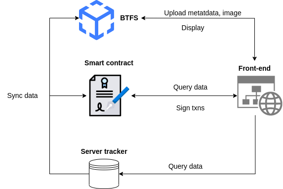

# 
Picasarts

Picasarts is an all-in-one financial solution for NFTs founded by Jacob Duong and James Ta. After the project was discontinued, it was transferred to me (neitdung) and I continued to develop this project into my graduation project.

# Fundamental functions:

- Create or import existing collection
- Mint NFTs
- Buy/Sell/Auction NFTs
- Use NFT as loan collateral
- Rent NFT
- Multiple accecpeted tokens
- Platform governance for manage artists, whitelist user, whitelist tokens and futher features

# Design
This system consists of 4 main components as below:

You can follow each document for install and deploy project:

- [Smart contracts](docs/contract.md)
- [Frontend](docs/frontend.md)
- [BTFS](docs/btfs.md)
- [Server tracker](docs/tracker.md)