# [Picasarts contracts](https://github.com/neitdung/picasarts-contracts)

## Install
Prerequites: [hardhat](https://hardhat.org/hardhat-runner/docs/getting-started#overview) 

- Clone repository: [picasarts-contracts](https://github.com/neitdung/picasarts-contracts)
- Install modules: ```npm install```
- Compile contracts: ```npx hardhat conpile```
- Config network in file: ```hardhat.config.js```
- Deploy contracts: ```npx hardhat run --network <network> scripts/deploy_all.js```
- Get file ```config.json``` and all files in folder ```abis```

## Design

Picasarts has 1 governance contract (Hub) and 3 feature contracts (Marketplace, Loan and Rental). For handle logic of feature contracts and futher extending contract, this is design of them:

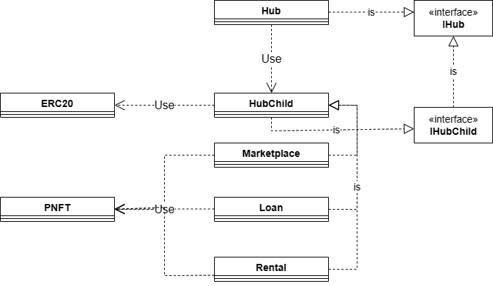

Those also use same a NFT standard contract called PNFT extend from ERC-721, ERC-2981 and ERC-4907. This is not required, you can create new PNFT contract by Hub or just import simple ERC-721 contract that extend Ownable contract but I encourage you use this contract for able using full product features.

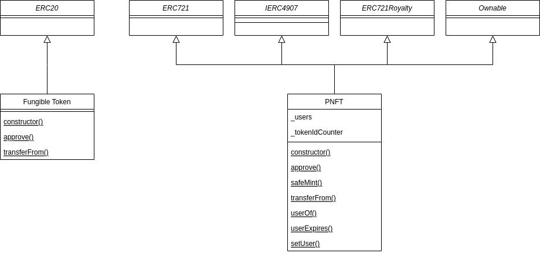

## Use cases and flow

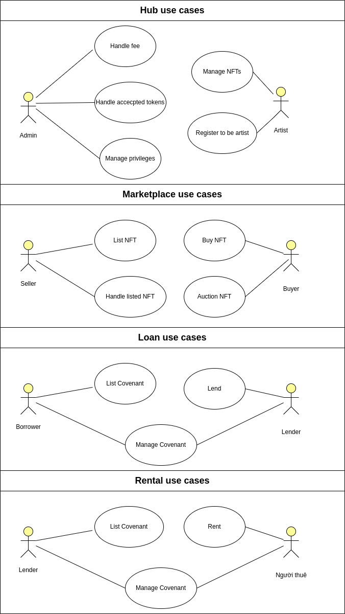

### Hub

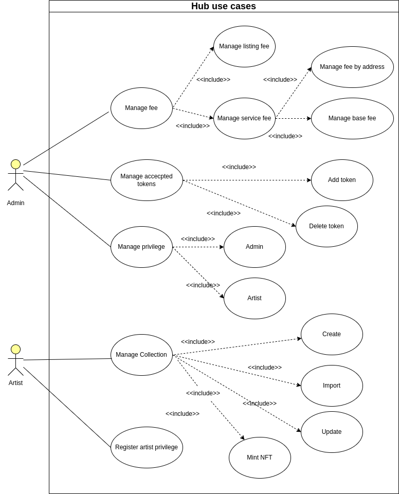

### Marketplace

- Use cases:
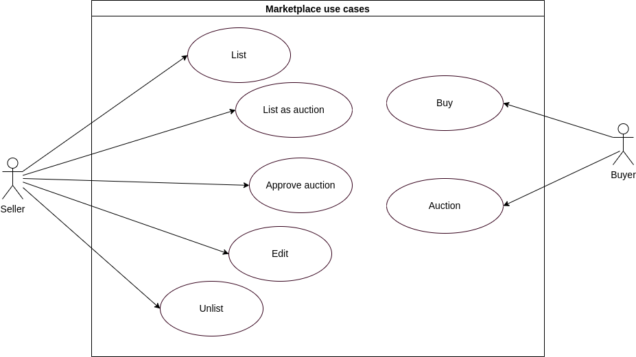
- Flow:
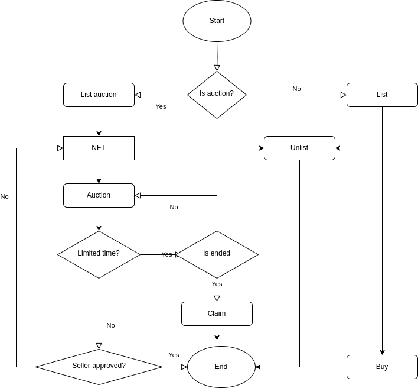

### Loan

- Use cases:
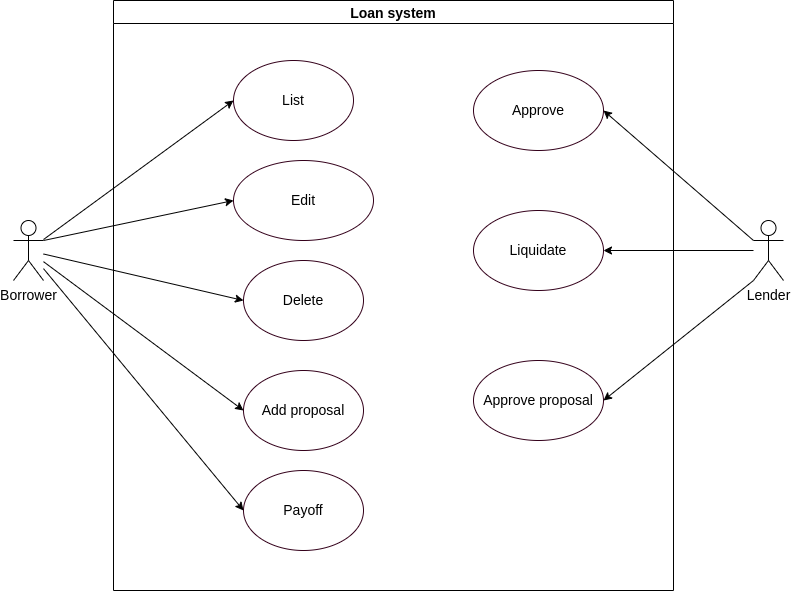
- Flow:
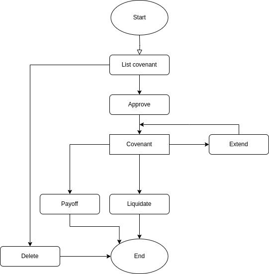
- Explain status after each action:
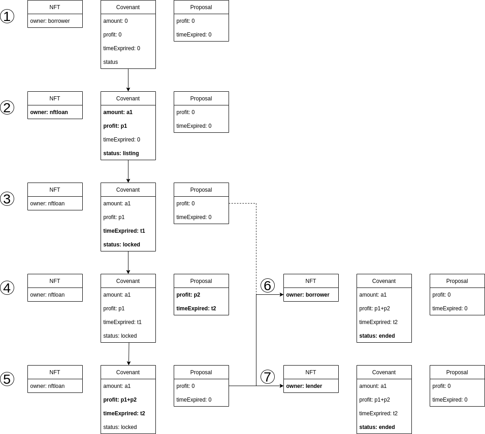

### Rental

- Use cases:
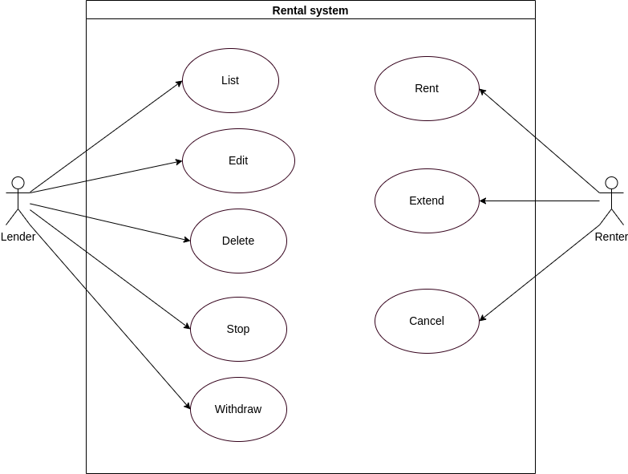
- Flow:
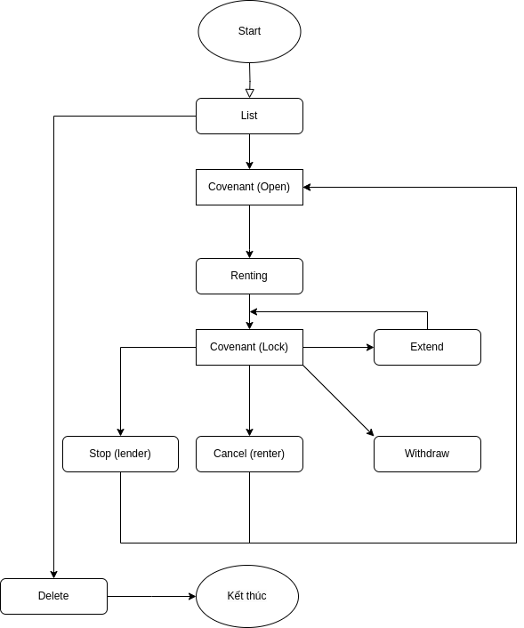
- Calculate amount can withdraw:
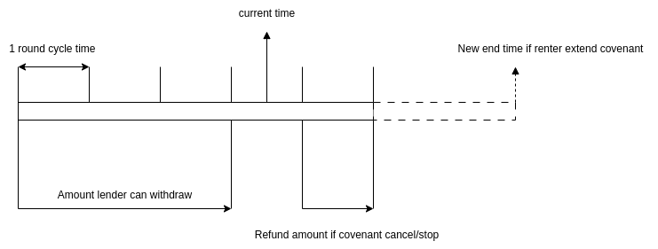